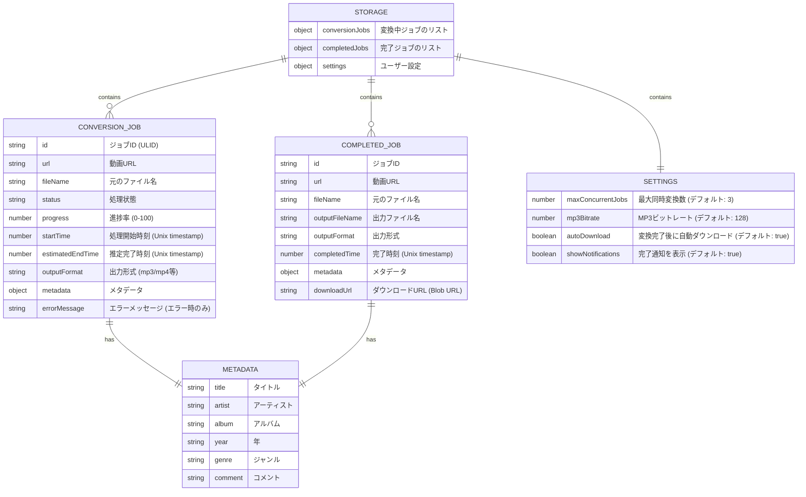
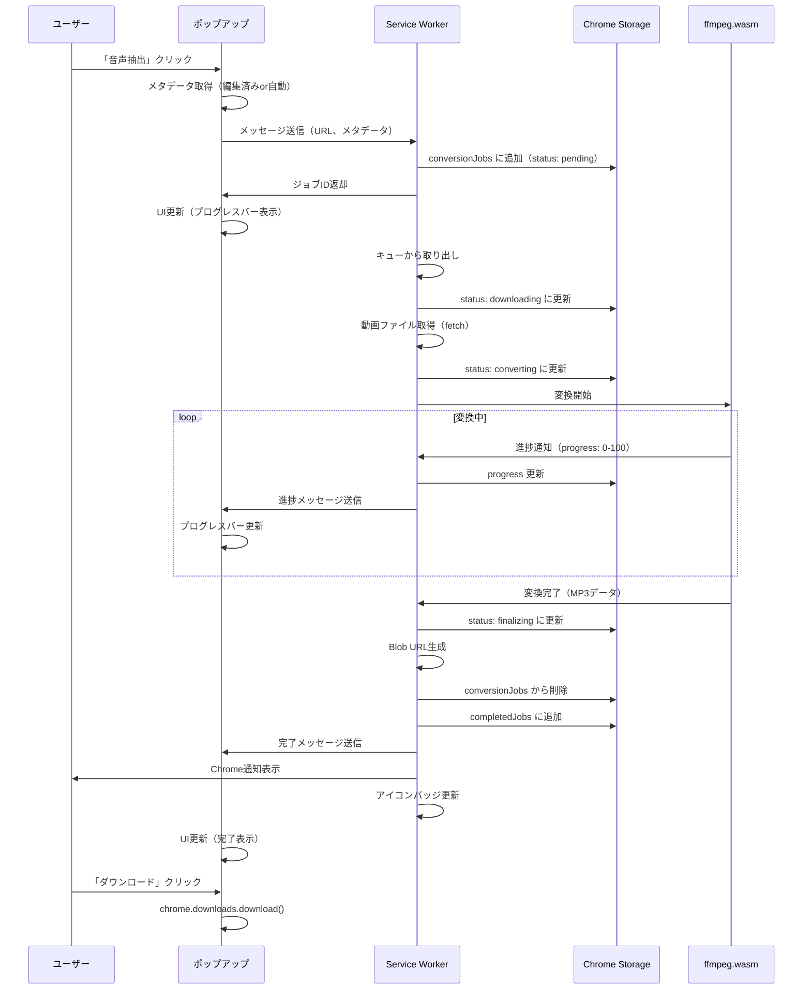
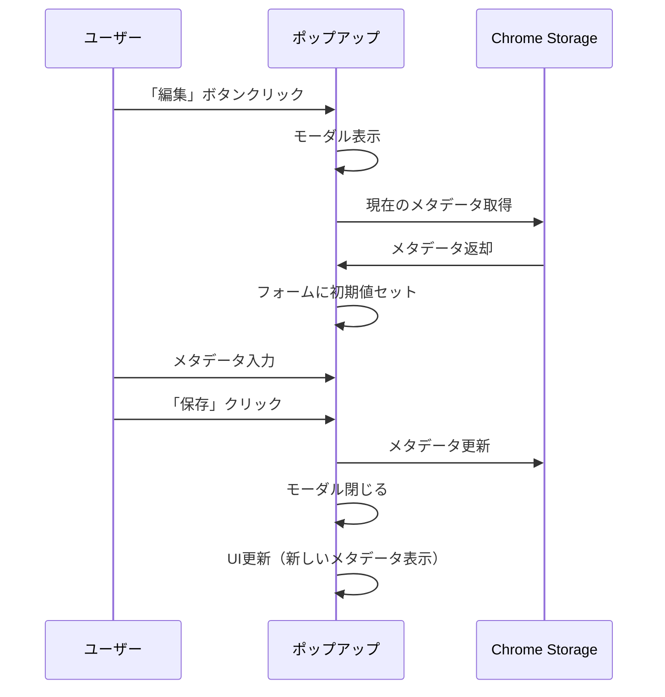

# データ構造設計

Chrome拡張機能のため、データベースではなくChrome Storage APIを使用します。
このドキュメントでは、保存するデータ構造をER図風に記載します。

---

## 1. Chrome Storageデータ構造

### 1.1 全体構成



---

## 2. データ構造詳細

### 2.1 conversionJobs（変換中ジョブ）

**保存場所**: `chrome.storage.local`
**キー**: `conversionJobs`
**型**: `Array<ConversionJob>`

```typescript
type ConversionJobStatus =
  | 'pending' // 待機中（キューに追加済み）
  | 'downloading' // 動画ダウンロード中
  | 'converting' // ffmpeg変換中
  | 'finalizing' // ファイル生成中
  | 'error'; // エラー発生

interface ConversionJob {
  /** ジョブID（ULID形式） */
  id: string;

  /** 動画URL */
  url: string;

  /** 元のファイル名 */
  fileName: string;

  /** 処理状態 */
  status: ConversionJobStatus;

  /** 進捗率（0-100） */
  progress: number;

  /** 処理開始時刻（Unix timestamp） */
  startTime: number;

  /** 推定完了時刻（Unix timestamp、計算値） */
  estimatedEndTime: number | null;

  /** 出力形式（'mp3' | 'mp4' | 'webm' 等） */
  outputFormat: string;

  /** メタデータ */
  metadata: Metadata;

  /** エラーメッセージ（エラー時のみ） */
  errorMessage?: string;
}
```

**例**:

```json
{
  "conversionJobs": [
    {
      "id": "01HQZX1234567890ABCDEFGH",
      "url": "https://example.com/video.mp4",
      "fileName": "sample_video.mp4",
      "status": "converting",
      "progress": 45,
      "startTime": 1706425200000,
      "estimatedEndTime": 1706425380000,
      "outputFormat": "mp3",
      "metadata": {
        "title": "Sample Video",
        "artist": "Unknown Artist",
        "album": "",
        "year": "",
        "genre": "",
        "comment": ""
      }
    }
  ]
}
```

---

### 2.2 completedJobs（完了ジョブ）

**保存場所**: `chrome.storage.local`
**キー**: `completedJobs`
**型**: `Array<CompletedJob>`

```typescript
interface CompletedJob {
  /** ジョブID（ULID形式） */
  id: string;

  /** 動画URL */
  url: string;

  /** 元のファイル名 */
  fileName: string;

  /** 出力ファイル名 */
  outputFileName: string;

  /** 出力形式 */
  outputFormat: string;

  /** 完了時刻（Unix timestamp） */
  completedTime: number;

  /** メタデータ */
  metadata: Metadata;

  /** ダウンロードURL（Blob URL） */
  downloadUrl: string;
}
```

**例**:

```json
{
  "completedJobs": [
    {
      "id": "01HQZX1234567890ABCDEFGH",
      "url": "https://example.com/video.mp4",
      "fileName": "sample_video.mp4",
      "outputFileName": "Unknown Artist - Sample Video.mp3",
      "outputFormat": "mp3",
      "completedTime": 1706425380000,
      "metadata": {
        "title": "Sample Video",
        "artist": "Unknown Artist",
        "album": "My Album",
        "year": "2024",
        "genre": "Pop",
        "comment": ""
      },
      "downloadUrl": "blob:chrome-extension://abc123/xyz789"
    }
  ]
}
```

---

### 2.3 Metadata（メタデータ）

```typescript
interface Metadata {
  /** タイトル（曲名・動画名） */
  title: string;

  /** アーティスト名 */
  artist: string;

  /** アルバム名 */
  album: string;

  /** リリース年 */
  year: string;

  /** ジャンル */
  genre: string;

  /** コメント */
  comment: string;
}
```

**デフォルト値**:

```json
{
  "title": "ファイル名から自動取得",
  "artist": "",
  "album": "",
  "year": "",
  "genre": "",
  "comment": ""
}
```

---

### 2.4 Settings（ユーザー設定）

**保存場所**: `chrome.storage.local`
**キー**: `settings`
**型**: `Settings`

```typescript
interface Settings {
  /** 最大同時変換数 */
  maxConcurrentJobs: number;

  /** MP3ビットレート（kbps） */
  mp3Bitrate: number;

  /** 変換完了後に自動ダウンロード */
  autoDownload: boolean;

  /** 完了通知を表示 */
  showNotifications: boolean;
}
```

**デフォルト値**:

```json
{
  "maxConcurrentJobs": 3,
  "mp3Bitrate": 128,
  "autoDownload": true,
  "showNotifications": true
}
```

---

## 3. Service Workerでの処理状態管理

Service Workerは以下の情報をメモリ上で管理します（永続化不要）。

### 3.1 ActiveJobs（実行中ジョブのマップ）

```typescript
/**
 * 実行中のffmpegプロセスを管理
 */
type ActiveJobs = Map<
  string,
  {
    /** ジョブID */
    jobId: string;

    /** ffmpegワーカー */
    worker: Worker;

    /** キャンセル用のAbortController */
    abortController: AbortController;

    /** 進捗更新用のコールバック */
    onProgress: (progress: number) => void;
  }
>;
```

---

### 3.2 JobQueue（待機中ジョブのキュー）

```typescript
/**
 * 同時実行数制限のためのキュー
 */
type JobQueue = Array<{
  /** ジョブID */
  jobId: string;

  /** 実行する処理 */
  execute: () => Promise<void>;
}>;
```

---

## 4. データフロー

### 4.1 音声抽出の処理フロー



---

### 4.2 メタデータ編集のフロー



---

## 5. データのライフサイクル

### 5.1 conversionJobs（変換中ジョブ）

| 状態 | タイミング                       | 保持期間     |
| ---- | -------------------------------- | ------------ |
| 追加 | ユーザーが「音声抽出」クリック   | -            |
| 更新 | 処理中（進捗・ステータス変更時） | -            |
| 削除 | 変換完了 or エラー発生           | 完了後即削除 |

### 5.2 completedJobs（完了ジョブ）

| 状態 | タイミング                            | 保持期間 |
| ---- | ------------------------------------- | -------- |
| 追加 | 変換完了時                            | -        |
| 削除 | ユーザーが「削除」クリック or 7日経過 | 最大7日  |

**自動削除ロジック**:

- Service Worker起動時に `completedTime` を確認
- 7日（604800000ミリ秒）以上経過したジョブを削除

---

## 6. ストレージ容量管理

### 6.1 容量制限

| ストレージ             | 上限                   | 対策                        |
| ---------------------- | ---------------------- | --------------------------- |
| Chrome Storage (local) | 無制限                 | 古いcompletedJobsを自動削除 |
| Blob URL               | ブラウザのメモリに依存 | ダウンロード後にrevokeする  |

### 6.2 最適化

- **completedJobs**: 最大100件まで保持、古いものから削除
- **Blob URL**: ダウンロード完了後に `URL.revokeObjectURL()` で解放
- **ffmpeg.wasm**: 初回ロード後はキャッシュに保存

---

## 7. データのバックアップ・復元

### 7.1 ブラウザクラッシュ時の復元

- Service Worker再起動時に `conversionJobs` をチェック
- `status: converting` のジョブを `status: error` に変更
- ユーザーに「処理中にエラーが発生しました」と表示

### 7.2 拡張機能の再インストール

- Chrome Storageはアンインストール時に削除される
- ユーザーデータは保持されない

---

## 8. セキュリティ

### 8.1 データの保存場所

| データ       | 保存場所                   | 外部送信 |
| ------------ | -------------------------- | -------- |
| 動画URL      | Chrome Storage（ローカル） | なし     |
| 動画ファイル | メモリ（一時的）           | なし     |
| 変換後MP3    | Blob（メモリ）             | なし     |
| メタデータ   | Chrome Storage（ローカル） | なし     |

### 8.2 プライバシー

- すべての処理はブラウザ内で完結
- 外部サーバーへのデータ送信なし
- ユーザーの端末外にデータは出ない

---

## 9. データ構造の初期化

### 9.1 拡張機能インストール時

```typescript
chrome.runtime.onInstalled.addListener(() => {
  chrome.storage.local.set({
    conversionJobs: [],
    completedJobs: [],
    settings: {
      maxConcurrentJobs: 3,
      mp3Bitrate: 128,
      autoDownload: true,
      showNotifications: true
    }
  });
});
```

---

## 10. データ構造の型定義まとめ

```typescript
/**
 * Chrome Storageの全体構造
 */
interface ChromeStorageData {
  conversionJobs: ConversionJob[];
  completedJobs: CompletedJob[];
  settings: Settings;
}

/**
 * 変換中ジョブ
 */
interface ConversionJob {
  id: string;
  url: string;
  fileName: string;
  status: 'pending' | 'downloading' | 'converting' | 'finalizing' | 'error';
  progress: number;
  startTime: number;
  estimatedEndTime: number | null;
  outputFormat: string;
  metadata: Metadata;
  errorMessage?: string;
}

/**
 * 完了ジョブ
 */
interface CompletedJob {
  id: string;
  url: string;
  fileName: string;
  outputFileName: string;
  outputFormat: string;
  completedTime: number;
  metadata: Metadata;
  downloadUrl: string;
}

/**
 * メタデータ
 */
interface Metadata {
  title: string;
  artist: string;
  album: string;
  year: string;
  genre: string;
  comment: string;
}

/**
 * ユーザー設定
 */
interface Settings {
  maxConcurrentJobs: number;
  mp3Bitrate: number;
  autoDownload: boolean;
  showNotifications: boolean;
}
```
