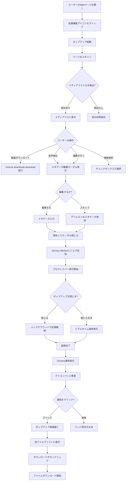
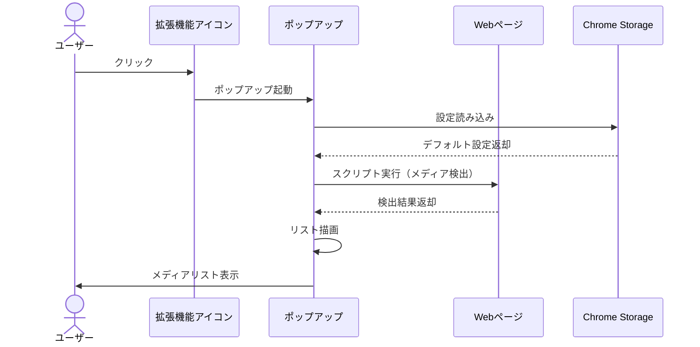
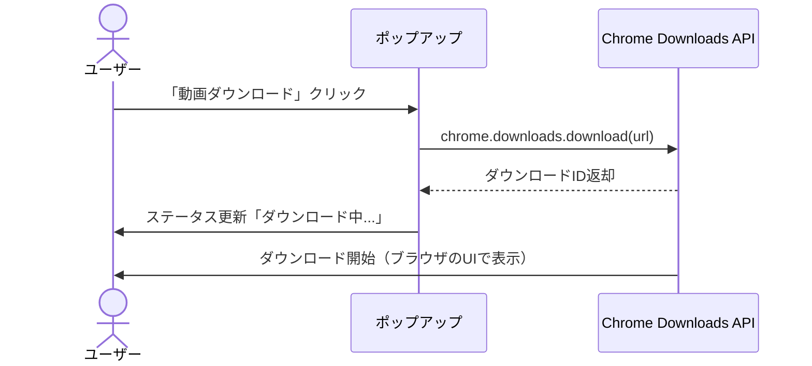
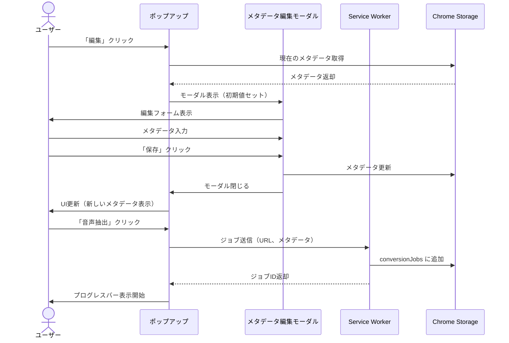
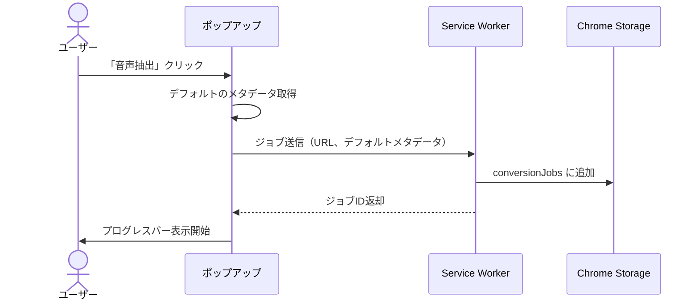
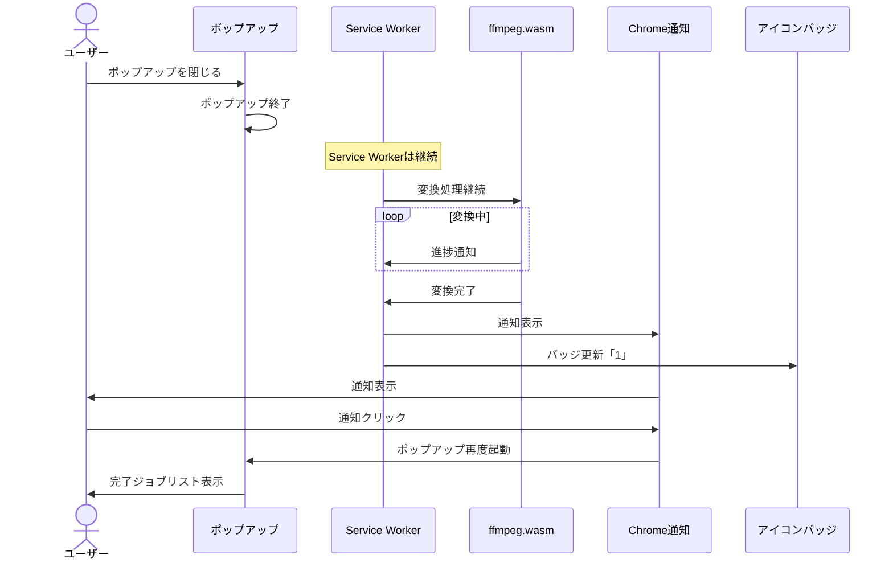
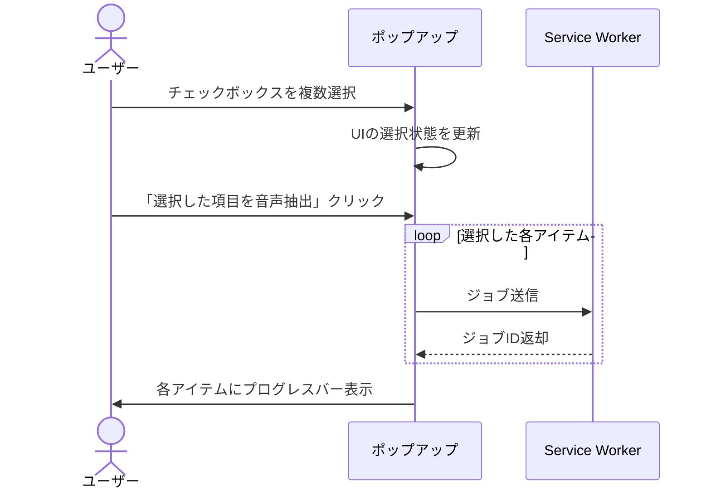
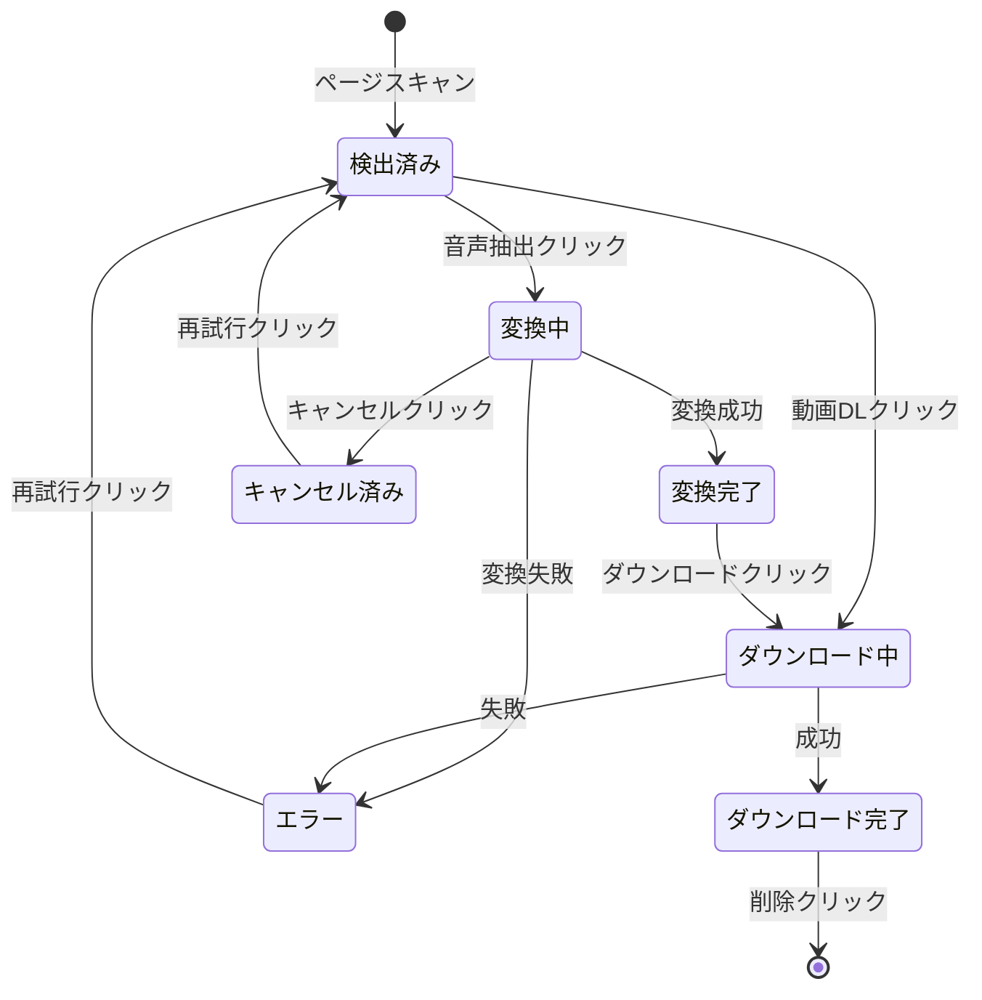
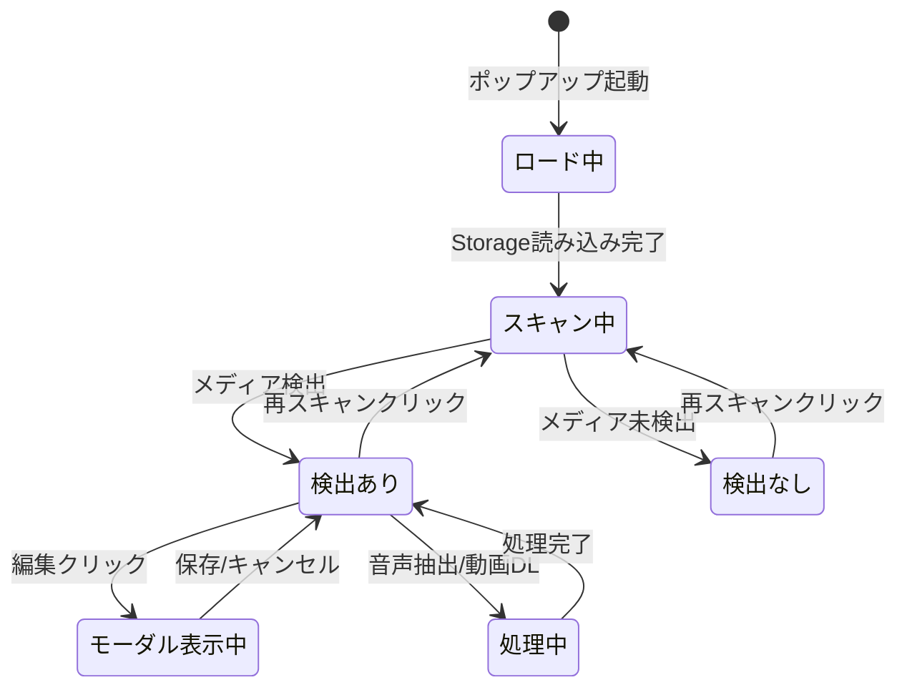

# 画面フロー設計

このドキュメントでは、ユーザーの操作フローと画面遷移を記載します。

---

## 1. 全体フロー図



---

## 2. ユーザーフロー詳細

### 2.1 初回起動フロー



**画面表示内容**:
- ヘッダー: 「Media Extractor」
- ステータス: 「3件の動画・音声を検出しました」
- リスト: 検出したメディアファイル
- 注意事項: 常時表示

---

### 2.2 動画ダウンロードフロー



**画面変更**:
- ボタン: 「動画ダウンロード」→ 「ダウンロード中...」（無効化）
- ステータステキスト: 「ダウンロード中: sample_video.mp4」

---

### 2.3 音声抽出フロー（編集あり）



**画面変更**:
- モーダル表示 → ユーザー入力 → モーダル閉じる
- プログレスバー表示: 0% → 変換中 → 100%

---

### 2.4 音声抽出フロー（編集なし）



**画面変更**:
- ボタン: 「音声抽出」→ プログレスバー表示
- ステータステキスト: 「変換中...」

---

### 2.5 バックグラウンド処理フロー



**画面変更**:
- ポップアップを閉じても処理継続
- 完了時に通知 + バッジ表示

---

### 2.6 複数選択・一括操作フロー



**画面変更**:
- チェックボックス: ☐ → ☑
- 一括ボタン: 有効化（選択数が1以上の場合）
- 各アイテムにプログレスバー表示

---

## 3. 画面レイアウト詳細

### 3.1 メインポップアップ（初期状態）

```
┌─────────────────────────────────────────┐
│ 🎬 Media Extractor         [再スキャン]  │ ← ヘッダー
├─────────────────────────────────────────┤
│ 📊 ページをスキャンしています...          │ ← ステータス
└─────────────────────────────────────────┘
```

**要素**:
- タイトル: 「Media Extractor」
- 再スキャンボタン: ページを再度スキャン
- ステータステキスト: 「ページをスキャンしています...」

---

### 3.2 メインポップアップ（検出あり）

```
┌─────────────────────────────────────────┐
│ 🎬 Media Extractor         [再スキャン]  │
├─────────────────────────────────────────┤
│ 📊 3件の動画・音声を検出しました          │
├─────────────────────────────────────────┤
│ ☑ すべて選択                             │ ← 一括選択
│ [選択した項目を動画DL] [選択した項目を音声抽出] │ ← 一括操作
├─────────────────────────────────────────┤
│ ☑ 🎬 sample_video.mp4                    │ ← アイテム1
│    https://example.com/video.mp4         │
│    [動画DL] [音声抽出] [編集]             │
│    ━━━━━━━━━━━━━━━━ 45% (残り1分20秒)  │ ← プログレスバー
├─────────────────────────────────────────┤
│ ☐ 🎵 audio_file.mp3                      │ ← アイテム2
│    https://example.com/audio.mp3         │
│    [ダウンロード] [編集]                  │
├─────────────────────────────────────────┤
│ ☐ 🎬 another_video.webm                  │ ← アイテム3
│    https://example.com/video.webm        │
│    [動画DL] [音声抽出] [編集]             │
├─────────────────────────────────────────┤
│ ⚠️ 注意事項                               │ ← 注意事項
│ • 大容量ファイルは処理に時間がかかります    │
│ • 変換中はメモリを多く使用します           │
│ • 著作権法を遵守してご使用ください         │
└─────────────────────────────────────────┘
```

**要素**:
- **ヘッダー**
  - タイトル: 「Media Extractor」
  - 再スキャンボタン

- **ステータステキスト**
  - 検出件数表示: 「3件の動画・音声を検出しました」

- **一括選択**
  - すべて選択チェックボックス
  - 一括操作ボタン（2つ）

- **メディアアイテムリスト**
  - チェックボックス
  - アイコン（動画 or 音声）
  - ファイル名
  - URL（グレー表示、折りたたみ可能）
  - 操作ボタン
  - プログレスバー（変換中のみ）

- **注意事項**
  - 常時表示

---

### 3.3 メインポップアップ（検出なし）

```
┌─────────────────────────────────────────┐
│ 🎬 Media Extractor         [再スキャン]  │
├─────────────────────────────────────────┤
│ 📊 メディアファイルが見つかりませんでした │
├─────────────────────────────────────────┤
│                                         │
│          📂                              │
│   このページには動画・音声ファイルが       │
│   検出されませんでした。                  │
│                                         │
│   別のページで試してください。            │
│                                         │
└─────────────────────────────────────────┘
```

**要素**:
- 空の状態メッセージ
- アイコン（フォルダ）

---

### 3.4 メタデータ編集モーダル

```
┌──────────────────────────────────────┐
│ メタデータ編集                [×]     │ ← ヘッダー
├──────────────────────────────────────┤
│ ファイル名: sample_video.mp4         │ ← 読み取り専用
├──────────────────────────────────────┤
│ タイトル:                             │
│ ┌──────────────────────────────────┐ │
│ │ Sample Video                     │ │ ← 入力フィールド
│ └──────────────────────────────────┘ │
│                                      │
│ アーティスト:                         │
│ ┌──────────────────────────────────┐ │
│ │                                  │ │
│ └──────────────────────────────────┘ │
│                                      │
│ アルバム:                             │
│ ┌──────────────────────────────────┐ │
│ │                                  │ │
│ └──────────────────────────────────┘ │
│                                      │
│ 年:          ジャンル:                │
│ ┌────────┐  ┌───────────────────┐   │
│ │        │  │                   │   │
│ └────────┘  └───────────────────┘   │
│                                      │
│ コメント:                             │
│ ┌──────────────────────────────────┐ │
│ │                                  │ │
│ │                                  │ │
│ └──────────────────────────────────┘ │
├──────────────────────────────────────┤
│              [キャンセル]  [保存]     │ ← ボタン
└──────────────────────────────────────┘
```

**要素**:
- ヘッダー: 「メタデータ編集」
- 閉じるボタン（×）
- ファイル名（読み取り専用）
- 入力フィールド（6つ）
  - タイトル
  - アーティスト
  - アルバム
  - 年
  - ジャンル
  - コメント
- キャンセルボタン
- 保存ボタン

---

### 3.5 変換中の表示

```
┌─────────────────────────────────────────┐
│ ☑ 🎬 sample_video.mp4                    │
│    https://example.com/video.mp4         │
│    変換中... 0.8x (残り約1分20秒)         │ ← ステータステキスト
│    ━━━━━━━━━━━━━━━━ 45%               │ ← プログレスバー
│    [キャンセル]                           │ ← キャンセルボタン
└─────────────────────────────────────────┘
```

**要素**:
- ステータステキスト: 「変換中... 0.8x (残り約1分20秒)」
- プログレスバー: 進捗率（0-100%）
- キャンセルボタン

**処理速度の表示**:
- `0.8x` = 実時間の0.8倍速（100秒の動画を125秒で変換）
- `1.5x` = 実時間の1.5倍速（100秒の動画を67秒で変換）

---

### 3.6 変換完了の表示

```
┌─────────────────────────────────────────┐
│ ☐ 🎵 sample_video.mp3                    │
│    Unknown Artist - Sample Video         │ ← メタデータ反映
│    ✅ 変換完了 (1分30秒)                  │ ← 完了ステータス
│    [ダウンロード] [削除]                  │ ← 操作ボタン
└─────────────────────────────────────────┘
```

**要素**:
- アイコン: 音声（🎵）
- ファイル名: メタデータから生成（`{アーティスト} - {タイトル}.mp3`）
- 完了ステータス: 「✅ 変換完了 (1分30秒)」
- ダウンロードボタン
- 削除ボタン

---

### 3.7 Chrome通知

```
┌──────────────────────────────────┐
│ 🎉 変換完了                       │ ← タイトル
│ sample_video.mp4 の音声抽出が      │
│ 完了しました                      │ ← メッセージ
│ クリックしてダウンロード           │
└──────────────────────────────────┘
```

**要素**:
- アイコン: 🎉
- タイトル: 「変換完了」
- メッセージ: ファイル名 + 「の音声抽出が完了しました」
- アクション: クリックでポップアップ起動

---

### 3.8 アイコンバッジ

```
┌────────┐
│  🎬    │ ← 拡張機能アイコン
│    [3] │ ← バッジ（完了件数）
└────────┘
```

**要素**:
- バッジ: 完了した件数を表示
- クリックでポップアップ起動

---

## 4. 状態遷移図

### 4.1 アイテムの状態遷移



---

### 4.2 ポップアップの状態遷移



---

## 5. 画面遷移のタイムライン

### 5.1 初回起動 → 音声抽出 → 完了

```
0:00  ユーザーがアイコンをクリック
      ↓
0:00  ポップアップ起動、ロード中表示
      ↓
0:01  ページスキャン完了、メディアリスト表示
      ↓
0:05  ユーザーが「編集」クリック
      ↓
0:05  メタデータ編集モーダル表示
      ↓
0:30  ユーザーがメタデータ入力完了、「保存」クリック
      ↓
0:30  モーダル閉じる、UI更新
      ↓
0:32  ユーザーが「音声抽出」クリック
      ↓
0:32  プログレスバー表示開始（0%）
      ↓
0:35  ユーザーがポップアップを閉じる
      ↓
...   バックグラウンドで変換処理継続
      ↓
2:30  変換完了、Chrome通知表示、バッジ更新
      ↓
2:32  ユーザーが通知をクリック
      ↓
2:32  ポップアップ再度起動、完了ジョブリスト表示
      ↓
2:35  ユーザーが「ダウンロード」クリック
      ↓
2:35  ファイルダウンロード開始
```

---

## 6. エラー画面

### 6.1 変換エラー

```
┌─────────────────────────────────────────┐
│ ☐ 🎬 sample_video.mp4                    │
│    https://example.com/video.mp4         │
│    ❌ エラー: ファイルを取得できませんでした │ ← エラーメッセージ
│    [再試行] [削除]                        │ ← 操作ボタン
└─────────────────────────────────────────┘
```

**エラーメッセージ例**:
- 「ファイルを取得できませんでした」
- 「変換に失敗しました」
- 「メモリ不足のため処理できませんでした」
- 「この形式はサポートされていません」

---

### 6.2 ダウンロードエラー

```
┌─────────────────────────────────────────┐
│ 📊 ダウンロードに失敗しました             │
│ ❌ ディスク容量が不足しています           │
└─────────────────────────────────────────┘
```

---

## 7. レスポンシブデザイン

### ポップアップサイズ
- **幅**: 360px（固定）
- **高さ**: 最小400px、最大600px
- **スクロール**: リストが多い場合は縦スクロール

---

## 8. アニメーション

### 8.1 プログレスバーのアニメーション
- スムーズな進捗変化（transition: 0.3s）

### 8.2 モーダルの表示/非表示
- フェードイン/フェードアウト（0.2s）

### 8.3 完了時のアニメーション
- チェックマーク（✅）のフェードイン

---

## 9. アクセシビリティ

### 9.1 キーボード操作
- **Tab**: フォーカス移動
- **Enter**: ボタンクリック
- **Esc**: モーダルを閉じる

### 9.2 スクリーンリーダー対応
- すべてのボタンに `aria-label` を設定
- プログレスバーに `aria-valuenow` を設定
- エラーメッセージに `role="alert"` を設定

---

## 10. 画面要素の優先度

| 優先度 | 要素 | 説明 |
|--------|------|------|
| 高 | メディアリスト | ユーザーが最も頻繁に操作 |
| 高 | 操作ボタン | 主要なアクション |
| 中 | プログレスバー | 処理状況の可視化 |
| 中 | メタデータ編集 | 任意の操作 |
| 低 | 注意事項 | 常時表示だが目立たせない |
